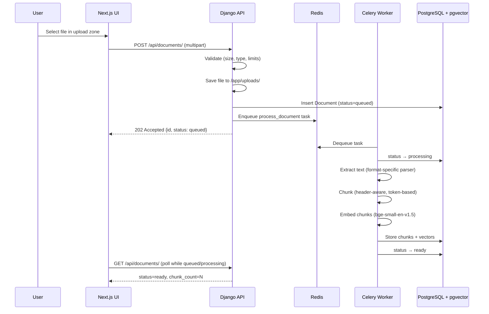
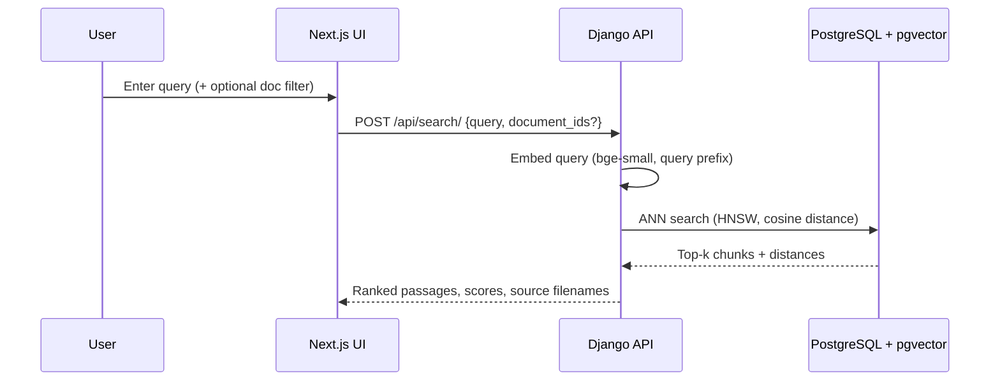

# Document Embedding & Search Service

A self-contained semantic search service: upload documents, generate local vector embeddings, and search across your corpus by meaning — not just keywords.

```bash
docker compose up -d --build
```

Open **http://localhost:3000** when all services are healthy.

---

## Quick Start

### Prerequisites

- Docker and Docker Compose v2+
- ~2 GB free disk (includes pre-baked embedding model)
- No API keys or external accounts required

### Run

```bash
git clone <repo-url>
cd qflow-assessment
docker compose up -d --build
```

The backend runs migrations and warms the embedding model on first start (may take 30–60 seconds). Check readiness:

```bash
curl http://localhost:8000/api/health/
```

### Try it

1. Open http://localhost:3000
2. Drag one or more files onto the upload zone (`.txt`, `.md`, `.pdf`, `.docx`)
3. Wait for status to show **Ready**
4. Type a natural-language query and search
5. Optionally filter search to specific documents

### Stop

```bash
docker compose down        # keep data
docker compose down -v     # remove database volume
```

---

## Architecture

```
┌─────────────┐     ┌──────────────────┐     ┌─────────────────┐
│  Next.js    │────▶│  Django + DRF    │────▶│  PostgreSQL 16  │
│  :3000      │     │  :8000           │     │  + pgvector     │
└─────────────┘     └────────┬─────────┘     └─────────────────┘
                             │
                    ┌────────▼─────────┐
                    │  Celery Worker   │
                    │  (embed jobs)    │
                    └────────┬─────────┘
                             │
                    ┌────────▼─────────┐
                    │  Redis           │
                    └──────────────────┘
```

| Layer | Choice | Role |
|-------|--------|------|
| Frontend | Next.js 14, Tailwind CSS | Upload UI, document list, search |
| API | Django 5 + Django REST Framework | REST endpoints, validation, rate limiting |
| Task queue | Celery + Redis | Async embedding for uploads (especially large / multi-file) |
| Database | PostgreSQL 16 + pgvector | Document metadata + vector storage in one place |
| Embeddings | `BAAI/bge-small-en-v1.5` (sentence-transformers) | Local semantic embeddings, no external API |
| File parsing | stdlib, pypdf, python-docx | Text extraction from supported formats |

### Services (Docker Compose)

| Service | Port | Description |
|---------|------|-------------|
| `frontend` | 3000 | Next.js app |
| `backend` | 8000 | Django API |
| `worker` | — | Celery worker for embedding pipeline |
| `db` | 5432 | PostgreSQL with pgvector extension |
| `redis` | 6379 | Celery broker and result backend |

---

## Workflow

### Upload & processing (sequence)

When a user uploads a file (e.g. `policy.md`), the API returns immediately and a background worker does the heavy lifting:



### Step-by-step

| Step | Where | What happens |
|------|-------|--------------|
| 1 | Frontend | User picks file → `POST /api/documents/` with `FormData` |
| 2 | API | Validates extension, size, magic bytes, corpus limits |
| 3 | API | Writes file to disk; creates `Document` row (`queued`) |
| 4 | API | Queues Celery task; returns `202` (does not wait for embedding) |
| 5 | Worker | Sets `processing`; extracts plain text from file |
| 6 | Worker | Splits into chunks (~512 tokens, ~64 overlap) |
| 7 | Worker | Encodes each chunk to a 384-dim vector |
| 8 | Worker | Saves chunks to `document_chunks` with pgvector; sets `ready` |
| 9 | Frontend | Polls `GET /api/documents/` only while status is `queued` or `processing` |
| 10 | User | Search → `POST /api/search/` → cosine similarity over stored vectors |

### Search flow



### Document status lifecycle

```
queued → processing → ready
                   ↘ failed (error_message stored)
```

### Frontend status updates

The UI polls `GET /api/documents/` every **3 seconds** only while any document is `queued` or `processing`. Polling stops when all documents are `ready` or `failed`.

For alternative approaches (SSE, WebSockets), see [docs/adr/001-document-status-updates.md](docs/adr/001-document-status-updates.md).

### UI / UX notes

- **Search-first layout** — upload, scoped search, results; no full document inventory in the browser
- **Search scope** — multi-select combobox (“All documents” when empty, or pick multiple files)
- **Recent uploads** — last 8 uploads with status; full corpus in Django admin
- **Relevance threshold** — only results above `SEARCH_MIN_SCORE` are returned; UI shows count above threshold
- **Result detail** — click a result to open a modal with the matching passage, query-term highlighting, and surrounding chunks (±1)
- **Duplicate uploads** — allowed; same filename creates a separate document (production would use content-hash dedup)

---

## Upload Limits & Validation

All limits are enforced server-side and configurable via environment variables.

| Limit | Default | Env var | Behavior when exceeded |
|-------|---------|---------|------------------------|
| Max file size | **50 MB** | `MAX_UPLOAD_SIZE_MB` | `413` — `FILE_TOO_LARGE` |
| Max files per request | **10** | `MAX_FILES_PER_UPLOAD` | `400` — `TOO_MANY_FILES` |
| Max total documents in corpus | **100** | `MAX_TOTAL_DOCUMENTS` | `400` — `CORPUS_LIMIT_REACHED` |
| Allowed extensions | `.txt`, `.md`, `.pdf`, `.docx` | `ALLOWED_EXTENSIONS` | `400` — `UNSUPPORTED_FILE_TYPE` |
| Empty files | rejected | — | `400` — `EMPTY_FILE` |

Additional validation:

- **Magic-byte sniffing** — extension must match actual file content (e.g. a `.pdf` rename is rejected)
- **Filename sanitization** — path traversal and unsafe characters stripped
- **Rate limiting** — uploads throttled to 10/min per IP; search to 60/min per IP (configurable)

Failed uploads store an `error_message` on the document record (visible in API and Django admin) instead of returning opaque 500 errors.

---

## API Reference

Base URL: `http://localhost:8000/api`

### Health

```bash
curl http://localhost:8000/api/health/
```

```json
{
  "status": "ok",
  "database": "ok",
  "embedding_model": "ready"
}
```

### Upload documents (multi-file)

```bash
curl -X POST http://localhost:8000/api/documents/ \
  -F "files=@report.pdf" \
  -F "files=@notes.md"
```

Response (`202 Accepted`):

```json
{
  "documents": [
    {
      "id": 1,
      "filename": "report.pdf",
      "status": "queued",
      "content_type": "application/pdf",
      "file_size": 204800
    }
  ]
}
```

Documents progress through: `queued` → `processing` → `ready` | `failed`

### List documents

```bash
curl http://localhost:8000/api/documents/
```

Paginated. Each entry includes `status`, `chunk_count`, `created_at`, and `error_message` (if failed).

### Get document

```bash
curl http://localhost:8000/api/documents/1/
```

### Delete document

```bash
curl -X DELETE http://localhost:8000/api/documents/1/
```

Removes the document and all associated chunks/embeddings.

### Search

Search across all documents (default):

```bash
curl -X POST http://localhost:8000/api/search/ \
  -H "Content-Type: application/json" \
  -d '{"query": "What is the refund policy?", "limit": 10}'
```

Search within specific documents:

```bash
curl -X POST http://localhost:8000/api/search/ \
  -H "Content-Type: application/json" \
  -d '{"query": "refund policy", "document_ids": [1, 3], "limit": 5}'
```

`min_score` is **not** a request parameter — it is set server-side via `SEARCH_MIN_SCORE` (default `0.5`). The response echoes the configured threshold as `min_score`.

Response:

```json
{
  "query": "What is the refund policy?",
  "min_score": 0.5,
  "limit": 10,
  "total_above_threshold": 2,
  "results": [
    {
      "score": 0.87,
      "text": "Customers may request a full refund within 30 days...",
      "document": {
        "id": 1,
        "filename": "policy.md",
        "created_at": "2026-06-24T15:55:36.123456+00:00"
      },
      "chunk_index": 2
    }
  ]
}
```

Results are ranked by similarity, filtered to `score >= min_score`, then capped at `limit`. `total_above_threshold` counts all matches above the threshold before the cap is applied.

Scores are cosine similarity (higher = more relevant).

### Chunk context (surrounding passages)

```bash
curl http://localhost:8000/api/documents/1/chunks/2/context/
```

Returns the matching chunk plus one chunk before and after (when they exist):

```json
{
  "document": { "id": 1, "filename": "policy.md", "created_at": "..." },
  "chunk_index": 2,
  "chunks": [
    { "chunk_index": 1, "text": "...", "is_match": false },
    { "chunk_index": 2, "text": "...", "is_match": true },
    { "chunk_index": 3, "text": "...", "is_match": false }
  ]
}
```

### Error format

```json
{
  "error": "File exceeds maximum size of 50 MB.",
  "code": "FILE_TOO_LARGE"
}
```

---

## Design Decisions

### Why PostgreSQL + pgvector instead of a dedicated vector database?

pgvector is a **PostgreSQL extension**, not a Python-specific tool. It stores vectors in a standard `vector` column alongside relational data. Any language with a Postgres driver can use it — including Java (JDBC, Spring Data JPA with [pgvector-java](https://github.com/pgvector/pgvector-java)).

| | PostgreSQL + pgvector | Dedicated vector DB (Qdrant, Milvus, Pinecone, etc.) |
|--|----------------------|------------------------------------------------------|
| Operations | One database to deploy, backup, and monitor | Additional infrastructure alongside your OLTP database |
| Consistency | Document metadata and embeddings in one ACID transaction | Risk of drift between a relational store and a vector store |
| Performance | Excellent with HNSW index up to low millions of vectors | Wins at very large scale (10M+ vectors, specialized ANN tuning) |
| Ecosystem fit | Natural if you already run Postgres | Better when vector search is the primary workload at huge scale |

**For this service and for most products at early-to-mid scale, pgvector is the right default.** You get semantic search without operating a second database. When corpus size or latency requirements outgrow single-node Postgres ANN performance, the migration path is to export vectors to Qdrant or Milvus — the chunking and embedding pipeline stays the same.

#### Java / Spring equivalents and comparisons

Since pgvector lives in Postgres, a Java shop would use the **same database choice** with a Java client library. There is no separate "Java version of pgvector" — the extension is database-level.

| Approach | Java integration | Notes |
|----------|-----------------|-------|
| **pgvector + PostgreSQL** | Spring Boot + JDBC / JPA + `pgvector-java` | Closest equivalent to this project. Same architecture, different language. |
| **Elasticsearch dense_vector** | Spring Data Elasticsearch | Very common in Java enterprise. Strong at hybrid keyword + vector search. Heavier to operate than pgvector for a small corpus. |
| **Qdrant** | Official Java client | Dedicated vector DB. Good Java SDK. Adds a separate service. |
| **Milvus** | Milvus Java SDK | Same trade-off as Qdrant. |
| **Weaviate** | Java client available | GraphQL API, built-in vectorization options (some require external models). |
| **Oracle AI Vector Search** | Native in Oracle DB 23c+ | Enterprise option if already on Oracle. |

**Recommendation for a Java team building the same product:** Spring Boot + PostgreSQL + pgvector is the direct port of this architecture. If the team already runs Elasticsearch for log/search, adding `dense_vector` fields there is a pragmatic alternative — at the cost of syncing document state between Postgres and ES.

### Why `BAAI/bge-small-en-v1.5` for embeddings?

| Model | Dimensions | Size | Retrieval quality |
|-------|-----------|------|-------------------|
| `all-MiniLM-L6-v2` | 384 | ~80 MB | Good baseline (widely used in tutorials) |
| **`BAAI/bge-small-en-v1.5`** ✅ | 384 | ~130 MB | Better MTEB retrieval scores, same vector width |
| `bge-base-en-v1.5` | 768 | ~440 MB | Higher quality, slower, larger Docker image |

We chose **bge-small** because it offers meaningfully better retrieval accuracy than MiniLM while remaining small enough to pre-bake into the Docker image and run on CPU without GPU. The model is loaded once at worker startup; encoding is batched (32 chunks per call) for throughput.

Fully local — no API keys, no network calls at runtime.

### Why custom format-aware chunking instead of LangChain?

LangChain's `RecursiveCharacterTextSplitter` is a reasonable default but adds a heavy dependency for a single utility. We implemented a **custom, format-aware chunker**:

| Format | Strategy |
|--------|----------|
| Markdown | Split on headers (`#`, `##`, `###`), then sub-chunk large sections |
| Plain text | Split on paragraphs, then sentences |
| PDF / DOCX | Extract text per page/section, then same sub-chunk logic |

Chunk sizing is **token-based** (target ~512 tokens, ~64 token overlap) using the embedding model's tokenizer — not character counts. This aligns chunk boundaries with how the model processes text and produces better retrieval quality.

For large files, text is extracted incrementally (page-by-page for PDF) to avoid loading entire files into memory.

### Why Celery for async processing?

Upload returns immediately with `202 Accepted` and a `queued` status. A Celery worker handles text extraction, chunking, and embedding in the background. This matters for:

- Multi-file uploads (10 files don't block the HTTP request)
- Large files (50 MB PDFs can take seconds to parse and embed)
- Horizontal scaling (`docker compose up --scale worker=2`)

Synchronous processing would be simpler (fewer containers) but would timeout on large uploads and provides no scaling story.

### Why search across all documents with an optional filter?

- **Default: global search** — best demo UX; users ask questions across their entire corpus
- **Optional `document_ids` filter** — real-world need ("search only within this contract")

Both are implemented. The frontend exposes an optional document selector on the search bar.

---

## Data Model

```
Document
├── id, filename, content_type, file_size
├── status (queued | processing | ready | failed)
├── error_message (nullable)
├── chunk_count
└── created_at, updated_at

DocumentChunk
├── id, document_id (FK, CASCADE delete)
├── chunk_index
├── text
├── embedding  vector(384)   ← bge-small-en-v1.5
└── token_count
```

Embeddings are indexed with **HNSW** (`vector_cosine_ops`) for fast approximate nearest-neighbor search.

---

## Configuration

Environment variables (set in `docker-compose.yml` or `.env`):

| Variable | Default | Description |
|----------|---------|-------------|
| `MAX_UPLOAD_SIZE_MB` | `50` | Max single file size |
| `MAX_FILES_PER_UPLOAD` | `10` | Max files per upload request |
| `MAX_TOTAL_DOCUMENTS` | `100` | Max documents stored in corpus |
| `ALLOWED_EXTENSIONS` | `txt,md,pdf,docx` | Comma-separated whitelist |
| `EMBEDDING_MODEL` | `BAAI/bge-small-en-v1.5` | HuggingFace model name |
| `CHUNK_SIZE_TOKENS` | `512` | Target tokens per chunk |
| `CHUNK_OVERLAP_TOKENS` | `64` | Overlap between chunks |
| `SEARCH_DEFAULT_LIMIT` | `10` | Default number of search results |
| `SEARCH_MIN_SCORE` | `0.5` | Minimum cosine similarity (0–1); server-side only, echoed in search responses |
| `SEARCH_CANDIDATE_MULTIPLIER` | `3` | Retrieve `limit × multiplier` candidates before threshold filtering |
| `THROTTLE_UPLOAD_RATE` | `10/min` | Upload rate limit per IP |
| `THROTTLE_SEARCH_RATE` | `60/min` | Search rate limit per IP |
| `DATABASE_URL` | (compose default) | PostgreSQL connection string |
| `REDIS_URL` | (compose default) | Redis connection string |

---

## Django Admin

Available at **http://localhost:8000/admin/** after creating a superuser:

```bash
docker compose exec backend python manage.py createsuperuser
```

Inspect documents, chunk counts, processing status, error messages, and individual chunks.

---

## Frontend

- **Next.js 14** (App Router) + **Tailwind CSS**
- **System theme** — respects `prefers-color-scheme` (light/dark)
- Single page: upload zone, document list with live status, search with optional document filter
- Upload progress, error toasts, and relevance scores on results

---

## Project Structure (planned)

```
qflow-assessment/
├── docker-compose.yml
├── README.md
├── backend/
│   ├── Dockerfile
│   ├── requirements.txt
│   ├── manage.py
│   └── app/
│       ├── settings.py
│       ├── models.py
│       ├── serializers.py
│       ├── views.py
│       ├── tasks.py              # Celery embedding pipeline
│       ├── throttling.py
│       ├── services/
│       │   ├── chunking.py       # Format-aware token chunker
│       │   ├── embeddings.py     # sentence-transformers wrapper
│       │   ├── parsers.py        # txt, md, pdf, docx extraction
│       │   └── search.py         # pgvector cosine search
│       └── management/
│           └── commands/
│               └── warmup_model.py
└── frontend/
    ├── Dockerfile
    ├── package.json
    └── src/
        └── app/
            ├── page.tsx
            ├── layout.tsx
            └── components/
                ├── UploadZone.tsx
                ├── DocumentList.tsx
                └── SearchPanel.tsx
```

---

## Scaling Path

What we'd add with more time and traffic:

| Stage | Addition |
|-------|----------|
| More throughput | Scale Celery workers (`--scale worker=N`), batch embedding tuning |
| Larger corpus | HNSW parameter tuning (`ef_construction`, `m`), IVFFlat for very large tables |
| Better relevance | Hybrid search (BM25 via Postgres full-text + vector reranking) |
| Bigger files | S3/MinIO object storage for raw files; stream-only processing |
| Production hardening | Gunicorn + Nginx, structured logging, Prometheus metrics, Sentry |
| Auth | API keys or OAuth2 per tenant; per-tenant corpus isolation |
| More formats | `.msg` (Outlook), `.html`, `.csv` with dedicated parsers |
| Java port | Spring Boot + pgvector-java — same architecture, direct mapping |

---

## What I'd Do Differently With More Time

1. **Hybrid search** — combine Postgres `tsvector` (BM25) with vector similarity for better results on exact terms (SKUs, names, legal clauses)
2. **Deduplication** — SHA-256 hash of file content to skip re-embedding identical uploads (duplicate filenames are currently allowed with a UI notice)
3. **SSE push updates** — replace conditional polling with Server-Sent Events for sub-second status (see [ADR 001](docs/adr/001-document-status-updates.md); WebSockets only if bidirectional real-time is needed)
4. **Integration tests** — end-to-end test suite that uploads a fixture doc and asserts search results
5. **CI pipeline** — GitHub Actions: lint, test, build Docker images
6. **Observability** — request IDs, embedding latency histograms, Celery queue depth monitoring

---

## License

Assessment project — not for redistribution.
