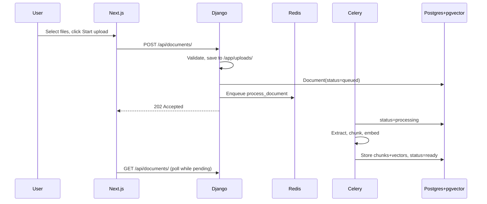
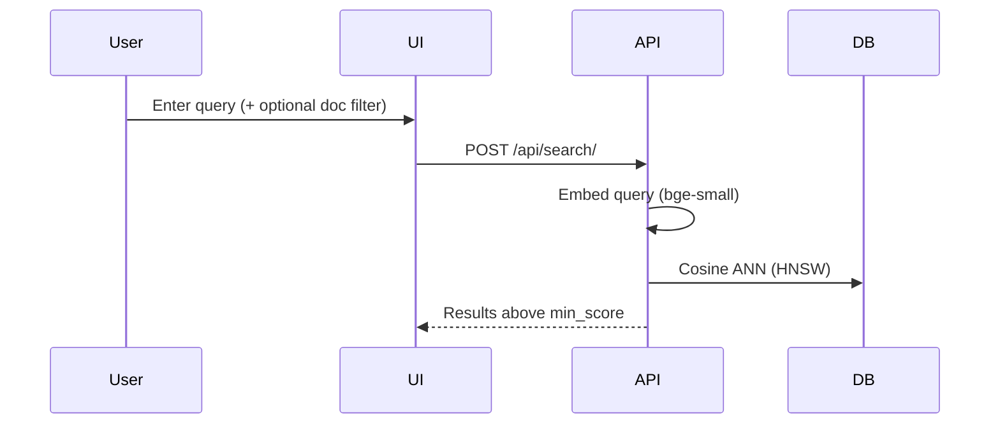

# Document Embedding & Search Service — Detailed Documentation

> For quick start, see [README.md](README.md).

---

## Architecture

```
┌─────────────┐     ┌──────────────────┐     ┌─────────────────┐
│  Next.js    │────▶│  Django + DRF    │────▶│  PostgreSQL 16  │
│  :3000      │     │  :8000           │     │  + pgvector     │
└─────────────┘     └────────┬─────────┘     └─────────────────┘
                             │
                    ┌────────▼─────────┐
                    │  Celery Worker   │
                    └────────┬─────────┘
                             │
                    ┌────────▼─────────┐
                    │  Redis           │
                    └──────────────────┘
```

| Layer | Choice |
|-------|--------|
| Frontend | Next.js 14, Tailwind CSS |
| API | Django 5 + DRF |
| Task queue | Celery + Redis |
| Database | PostgreSQL 16 + pgvector (HNSW) |
| Embeddings | `BAAI/bge-small-en-v1.5` (sentence-transformers, CPU) |
| File parsing | stdlib, pypdf, python-docx |
| Storage | Local volume `/app/uploads` (S3/MinIO for production) |

---

## Workflow

### Upload & processing



### Search



### Document status

```
queued → processing → ready
                   ↘ failed
```

---

## How Embedding Works

1. **Extract text** — format-specific parser (txt/md/pdf/docx)
2. **Chunk** — format-aware, token-based (~512 tokens, ~64 overlap)
   - Markdown: split on headers first
   - Plain text: paragraphs → sentences
3. **Embed** — `BAAI/bge-small-en-v1.5` via sentence-transformers
   - Passages encoded as-is
   - Batched (32 chunks per call), normalized vectors
4. **Store** — `DocumentChunk` rows with `embedding vector(384)` in pgvector
5. **Index** — HNSW index on embeddings for fast ANN search

## How Search Works

1. **Embed query** — same model, with bge retrieval prefix:
   `"Represent this sentence for searching relevant passages: {query}"`
2. **Retrieve candidates** — `limit × SEARCH_CANDIDATE_MULTIPLIER` via cosine distance (HNSW)
3. **Filter** — keep only `score >= SEARCH_MIN_SCORE` (default 0.5)
4. **Return** — top `limit` results with scores, text, document metadata

Score = `1 - cosine_distance` (higher = more relevant).

---

## API Reference

Base URL: `http://localhost:8000/api`

### Health

```bash
curl http://localhost:8000/api/health/
```

### Upload (multi-file)

```bash
curl -X POST http://localhost:8000/api/documents/ \
  -F "files=@report.pdf" -F "files=@notes.md"
```

Returns `202` with `status: queued`. Worker processes asynchronously.

### List / get / delete

```bash
curl http://localhost:8000/api/documents/
curl http://localhost:8000/api/documents/1/
curl -X DELETE http://localhost:8000/api/documents/1/
```

### Full document content

```bash
curl http://localhost:8000/api/documents/1/content/
```

Returns extracted text. Truncated at `DOCUMENT_CONTENT_MAX_CHARS` (default 120k).

### Search

```bash
curl -X POST http://localhost:8000/api/search/ \
  -H "Content-Type: application/json" \
  -d '{"query":"refund policy","limit":10,"document_ids":[1,3]}'
```

`min_score` is server-side only (`SEARCH_MIN_SCORE`). Response:

```json
{
  "query": "refund policy",
  "min_score": 0.5,
  "limit": 10,
  "total_above_threshold": 2,
  "results": [
    {
      "score": 0.87,
      "text": "...",
      "document": { "id": 1, "filename": "policy.md", "created_at": "..." },
      "chunk_index": 2
    }
  ]
}
```

### Chunk context (surrounding passages)

```bash
curl http://localhost:8000/api/documents/1/chunks/2/context/
```

Returns match chunk ±1 neighbor with `is_match` flag.

### Errors

```json
{ "error": "File exceeds maximum size of 50 MB.", "code": "FILE_TOO_LARGE" }
```

---

## Upload Limits

| Limit | Default | Env var |
|-------|---------|---------|
| Max file size | 50 MB | `MAX_UPLOAD_SIZE_MB` |
| Max files per request | 10 | `MAX_FILES_PER_UPLOAD` |
| Max total documents | 100 | `MAX_TOTAL_DOCUMENTS` |
| Allowed extensions | txt, md, pdf, docx | `ALLOWED_EXTENSIONS` |

Also: magic-byte validation, filename sanitization, rate limiting (10 uploads/min, 60 searches/min per IP).

---

## Design Decisions

### Why PostgreSQL + pgvector?

Vectors stored alongside relational metadata in one ACID database. No separate vector DB to operate. Excellent with HNSW up to low millions of vectors. Java teams can use the same approach via [pgvector-java](https://github.com/pgvector/pgvector-java).

Dedicated vector DBs (Qdrant, Milvus) win at billion-scale but add infrastructure complexity.

### Why bge-small-en-v1.5?

Better retrieval quality than MiniLM at similar size (~130 MB). Runs on CPU, pre-baked in Docker image. Fully local — no API keys.

### Why custom chunking (not LangChain)?

Format-aware splitting (headers for markdown, paragraphs for text) with token-based sizing aligned to the embedding model's tokenizer.

### Why Celery?

Upload returns immediately; embedding runs in background. Handles multi-file and large uploads without HTTP timeouts. Scales with `--scale worker=N`.

### Why staged upload?

User selects files first, then explicitly clicks "Start upload". Prevents accidental uploads and gives control over when processing begins.

---

## Data Model

```
Document
├── id, filename, content_type, file_size, file_path
├── status (queued | processing | ready | failed)
├── error_message, chunk_count
└── created_at, updated_at

DocumentChunk
├── document_id (FK, CASCADE)
├── chunk_index, text, token_count
└── embedding vector(384)  ← HNSW indexed
```

---

## Configuration

Full list in `docker-compose.yml`. Key vars:

| Variable | Default | Description |
|----------|---------|-------------|
| `SEARCH_MIN_SCORE` | `0.5` | Min cosine similarity for results |
| `SEARCH_CANDIDATE_MULTIPLIER` | `3` | Candidates fetched before threshold filter |
| `CHUNK_SIZE_TOKENS` | `512` | Target chunk size |
| `CHUNK_OVERLAP_TOKENS` | `64` | Overlap between chunks |
| `DOCUMENT_CONTENT_MAX_CHARS` | `120000` | Max chars in full-doc view |

---

## Django Admin

```bash
docker compose exec backend python manage.py createsuperuser
```

Open http://localhost:8000/admin/ — inspect documents, chunks, statuses.

---

## UI / UX

- Search-first layout (no full document inventory in browser)
- Multi-select scope combobox (empty = all docs)
- Recent uploads (latest 8) with status badges
- Staged upload with explicit "Start upload"
- Result modal: highlighted passage, ±1 chunk context, optional full doc text
- Delete confirmation dialog
- Conditional polling (only while docs are queued/processing)

See [docs/adr/001-document-status-updates.md](docs/adr/001-document-status-updates.md) for polling vs SSE/WebSocket trade-offs.

---

## Scaling Path

| Stage | Addition |
|-------|----------|
| Throughput | Scale Celery workers, batch tuning |
| Larger corpus | HNSW tuning, IVFFlat |
| Better relevance | Hybrid BM25 + vector reranking |
| Bigger files | S3/MinIO storage, stream processing |
| Production | Gunicorn, Nginx, metrics, Sentry, auth |
| More formats | MSG, HTML, CSV parsers |

---

## If More Time

1. **Hybrid search** — Postgres `tsvector` (BM25) + vector reranking
2. **Content-hash dedup** — skip re-embedding identical files
3. **SSE push updates** — replace polling for status
4. **Cross-encoder reranker** — improve top-k quality
5. **Integration tests** — upload fixture, assert search results
6. **CI pipeline** — GitHub Actions
7. **S3/MinIO** — object storage for uploads
8. **Observability** — request IDs, latency histograms, queue depth

---

## License

Assessment project — not for redistribution.
