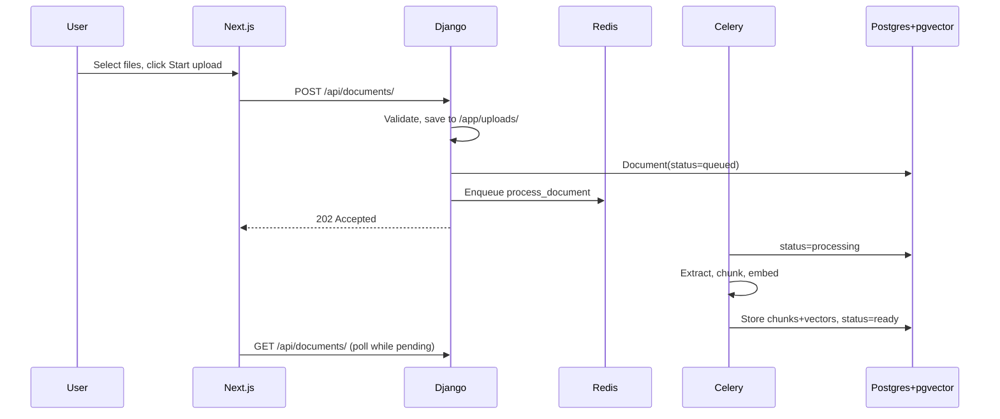
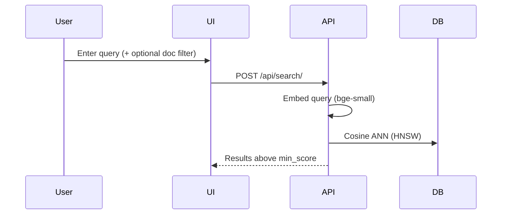

# Architecture

## Overview

Semantic document search: upload files, embed them locally, search by meaning with pgvector. Five Docker services — PostgreSQL, Redis, Django API, Celery worker, Next.js frontend.

```
┌─────────────┐     ┌──────────────────┐     ┌─────────────────┐
│  Next.js    │────▶│  Django + DRF    │────▶│  PostgreSQL 16  │
│  :3000      │     │  :8000           │     │  + pgvector     │
└─────────────┘     └────────┬─────────┘     └─────────────────┘
                             │
                    ┌────────▼─────────┐
                    │  Celery Worker   │
                    └────────┬─────────┘
                             │
                    ┌────────▼─────────┐
                    │  Redis           │
                    └──────────────────┘
```

| Layer | Choice |
|-------|--------|
| Frontend | Next.js 14, Tailwind CSS |
| API | Django 5 + DRF |
| Task queue | Celery + Redis |
| Database | PostgreSQL 16 + pgvector (HNSW) |
| Embeddings | `BAAI/bge-small-en-v1.5` (local, CPU) — see [Embeddings](embeddings.md) |
| Chunking | Custom, format-aware — see [Chunking strategy](chunking-strategy.md) |
| File parsing | stdlib, pypdf, python-docx |
| Storage | Local volume `/app/uploads` (S3/MinIO for production) |

---

## Upload and processing



Document lifecycle:

```
queued → processing → ready
                   ↘ failed
```

The API returns immediately after saving the file. Embedding runs in the Celery worker so uploads never block on model inference.

---

## Search



1. Embed the query with the same model used for documents (with bge’s retrieval prefix).
2. Fetch `limit × SEARCH_CANDIDATE_MULTIPLIER` nearest chunks via HNSW cosine distance.
3. Filter to `score >= SEARCH_MIN_SCORE`.
4. Return top `limit` results.

Score = `1 - cosine_distance` (higher = more relevant).

---

## Data model

```
Document
├── id, filename, content_type, file_size, file_path
├── status (queued | processing | ready | failed)
├── error_message, chunk_count
└── created_at, updated_at

DocumentChunk
├── document_id (FK, CASCADE)
├── chunk_index, text, token_count
└── embedding vector(384)  ← HNSW indexed
```

---

## Design decisions

### PostgreSQL + pgvector

Vectors live alongside relational metadata in one ACID database. No separate vector DB to operate. HNSW handles low millions of vectors well. Teams on other stacks can use the same pattern (e.g. [pgvector-java](https://github.com/pgvector/pgvector-java)).

Dedicated vector DBs (Qdrant, Milvus) win at billion-scale but add infrastructure for an assessment-sized corpus.

### Celery for async processing

Upload returns `202` immediately. Embedding can take seconds per document; running it in a worker avoids HTTP timeouts and keeps the API responsive. Scale with `docker compose up --scale worker=N`.

Migrations run only on the `web` entrypoint; the worker waits for the API healthcheck to avoid migration races.

### Custom chunking (not LangChain)

Format-aware splitting with token counts aligned to the embedding model’s tokenizer. Full rationale in [Chunking strategy](chunking-strategy.md).

### Local embeddings

No external API keys, predictable cost, works offline in Docker. Details in [Embeddings](embeddings.md).

### Staged upload

User selects files first, then clicks **Start upload**. Prevents accidental uploads and makes multi-file batches explicit.

### Conditional status polling

Poll `GET /api/documents/` every 3s only while any doc is `queued` or `processing`. See [ADR 001](adr/001-document-status-updates.md).

---

## UI summary

- Search-first layout (no full document inventory)
- Multi-select scope combobox (empty = all docs)
- Recent uploads (latest 8) with download and delete
- Result modal: highlighted passage, ±1 chunk context, optional full extracted text
- Delete requires confirmation

---

## Django admin

```bash
docker compose exec backend python manage.py createsuperuser
```

Open http://localhost:8000/admin/ to inspect documents, chunks, and statuses.

---

## Scaling path

| Stage | Addition |
|-------|----------|
| Throughput | Scale Celery workers, batch tuning |
| Larger corpus | HNSW tuning, IVFFlat |
| Better relevance | Hybrid BM25 + vector reranking |
| Bigger files | S3/MinIO storage, stream processing |
| Production | Gunicorn, Nginx, metrics, Sentry, auth |
| More formats | MSG, HTML, CSV parsers |

---

## If more time

1. Hybrid search — Postgres `tsvector` (BM25) + vector reranking
2. Content-hash dedup — skip re-embedding identical files
3. SSE push updates — replace polling for status
4. Cross-encoder reranker — improve top-k quality
5. Integration tests — upload fixture, assert search results
6. CI pipeline — GitHub Actions
7. S3/MinIO — object storage for uploads
8. Observability — request IDs, latency histograms, queue depth
